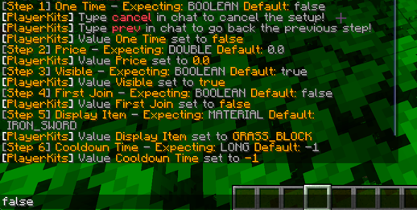
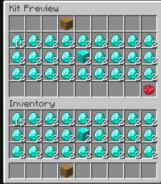
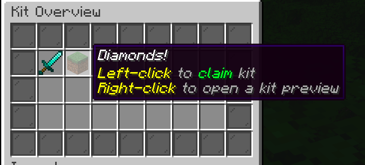

# Playerkits
Responsible:
@TheShadowsDust, @Seelenretterin

## English:

### Description:

This project playerkits is aiming to set up and deliver rewards / kits to players in different categories.

---

### Installation:
- You need a Hibernate supported database (for example PostGreSQL) and the plugin on a paper server (1.21.1)
- You need Java 21 or higher, best is 21 lts
- optional is Vault for economy
---
### Setup:
After the plugin is enabled and the database connection works, you can create kits in game.
1. Check if you have sufficient permissions, if not, annoy your administrator to do so (Check out "Permissions" here)
2. Get your kit items in your inventory (if you don't know how, check out the title "Inventory")
3. Start with `/kit create <name>` and replace name with the wanted kit name.
When the setup starts, **don't** use slash commands, just write what is expected / what you want to be enabled. You can also correct mistakes with going back and forth in the setup
4. When you are done, check if everything fits with the `/kits` command or give yourself a kit with `/kit give <player> <kit>`
5. You can also delete kits, check out "Table of features"

Here is an **example**:

Check out "Kinds of kits" to know what you can do.
---
#### Kinds of kits
To set up a kit, you need to know there are several types of kits, for example:
- The one-time kit
  - This kit can only be claimed once for each player, if this feature is enabled / true
- The first-time kit
  - This kit can only be claimed when the player joins for the first time (get it before it is gone!)
- Kit with a price
  - This kit can only be claimed when an economy plugin (vault) is installed and the player mets the required amount
  - Every kit can have a price
- Kit with cooldown
  - This kit can only be claimed again when the cooldown is depleted / gone.
  - Every kit can have a cooldown
- (In)visible kit
  - If you enable invisibility of the kit, you can't claim it in the player menu and only give it manually to the player
---
#### Inventory
##### Kit space
To set rewards in a kit, you need to know how:

(Right-click a created kit to see a preview)
The hotbar and the inventory of the setup player is used as kit creation space. 
The row where the red dye is at, is **reserved** and can't be used.
---
##### Kits menu

---
### Table of features

| Permission                    | Command                    | Usage                    |
|-------------------------------|----------------------------|--------------------------|
| playerkits.command.kit.create | `/kit create <name>`       | Create a new kit (setup) |
| playerkits.command.help       | `/kit help [query]`        | Shows the help menu      |
| playerkits.command.kits       | `/kits`                    | Open the kits overview   |
| playerkits.command.give       | `/kit give <player> <kit>` | Give a player a kit      |
| playerkits.command.delete     | `/kit delete <name>`       | Delete a Kit             |

## Deutsch:

### Beschreibung:

Dieses Projekt playerkits zielt darauf ab, Belohnungen / Kits für Spieler in verschiedenen Kategorien einzurichten und zu liefern.

---

### Installation:
- Du benötigst eine Hibernate unterstützte Datenbank (z.B. PostGreSQL) und das Plugin auf einem Paper Server (1.21.1)
- Du solltest Java 21 oder höher verwenden, am besten 21 lts
- optional ist Vault für Economy
---
### Einrichten:
Nachdem das Plugin aktiviert ist und die Datenbankverbindung funktioniert, kannst du Kits im Spiel erstellen.
1. Prüfe, ob du ausreichende Rechte hast, wenn nicht, nerve deinen Administrator, dies zu tun (siehe „Berechtigungen“)
2. Nimm deine Kits in dein Inventar auf (wenn du nicht weißt, wie das geht, schau dir den Titel „Inventar“ an)
3. Starte mit `/kit create <name>` und ersetze name durch den gewünschten Kit-Namen.
   Wenn die Einrichtung beginnt, **benutze** keine Schrägstrich-Befehle, schreibe einfach, was erwartet wird / was du aktivieren willst. Sie können auch Fehler korrigieren, indem Sie im Setup hin und her gehen
4. Wenn du fertig bist, überprüfe, ob alles passt mit dem `/kits` Befehl oder gib dir ein Kit mit `/kit give <player> <kit>`
5. Du kannst auch Kits löschen, sieh dir die „Table of features“ an.

Hier ist ein **Beispiel**:

Schaue unter „Arten von Bausätzen“ nach, um zu erfahren, was du tun kannst.
---
#### Arten von Kits
Um ein Kit zu erstellen, musst du wissen, dass es verschiedene Arten von Kits gibt, zum Beispiel
- Das einmalige Kit
  - Dieses Kit kann nur einmal für jeden Spieler beansprucht werden, wenn diese Funktion aktiviert / true ist
- Das erstmalige Kit
  - Dieses Kit kann nur beansprucht werden, wenn der Spieler zum ersten Mal beitritt (hol es dir, bevor es weg ist!)
- Kit mit einem Preis
  - Dieses Kit kann nur beansprucht werden, wenn ein Wirtschafts-Plugin ("Vault") installiert ist und der Spieler den erforderlichen Betrag erreicht hat.
  - Jedes Kit kann einen Preis haben
- Kit mit Abklingzeit
  - Dieses Kit kann erst dann wieder beansprucht werden, wenn die Abklingzeit aufgebraucht / abgelaufen ist.
  - Jedes Kit kann eine Abklingzeit haben
- (Un)sichtbares Kit
  - Wenn du die Unsichtbarkeit des Kits aktivierst, kannst du es nicht im Spielermenü beanspruchen und es nur manuell an den Spieler weitergeben
---
#### Inventar
##### Kit-Platz
Um Belohnungen in einem Kit zu setzen, müssen Sie wissen, wie:

(Klicke mit der rechten Maustaste auf ein erstelltes Kit, um eine Vorschau zu sehen)
Die Hotbar und das Inventar des Einrichtungsspielers werden als Platz für die Erstellung von Kits verwendet.
Die Zeile, in der sich der rote Farbstoff befindet, ist **reserviert** und kann nicht verwendet werden.
---
##### Menü Kits

---
### Tabelle der Funktionen

| Permission                    | Command                    | Usage                          |
|-------------------------------|----------------------------|--------------------------------|
| playerkits.command.kit.create | `/kit create <name>`       | Erstelle ein neues Kit (setup) |
| playerkits.command.help       | `/kit help [query]`        | Zeigt das Hilfe Menü an        |
| playerkits.command.kits       | `/kits`                    | Öffnet die Kit Vorschau        |
| playerkits.command.give       | `/kit give <player> <kit>` | Gebe einem Spieler ein Kit     |
| playerkits.command.delete     | `/kit delete <name>`       | Lösche ein Kit                 |

